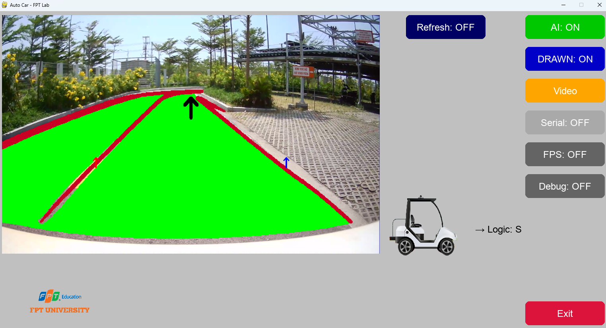

# Autonomous Driving System - Version 1.0

**FPT University at Quy Nhon**  
**System Developer:** Ha Khai Hoan – QE170157  
📌 GitHub: [Hoanha2101](https://github.com/Hoanha2101/Hoanha2101)  
📌 Model Source: [YOLOPv2 - CAIC-AD](https://github.com/CAIC-AD/YOLOPv2)

---

## Introduction

**Autonomous Driving System - version 1.0** is an integrated system combining the powerful YOLOPv2 vision model with a practical processing pipeline developed by a student of FPT University Quy Nhon. This project aims to handle real-time camera input for lane segmentation, object detection, and traffic scene understanding in autonomous vehicles.



---

## Copyright

- **Model:** Belongs to the research team at [CAIC-AD/YOLOPv2](https://github.com/CAIC-AD/YOLOPv2)
- **Processing System & Inference Pipeline:** Developed by **Ha Khai Hoan – QE170157 – FPT University Quy Nhon**  
  GitHub: [Hoanha2101](https://github.com/Hoanha2101/Hoanha2101)

---

## Project Status

| Component                    | Status                         |
|-----------------------------|--------------------------------|
| ✅ Model Training (YOLOPv2)  | Not public (paper under review) |
| ✅ PyTorch Inference         | Available                      |
| ⏳ ONNX Conversion           | Coming soon                    |
| ✅ ONNX Inference            | Available                      |
| ✅ TensorRT Conversion       | Available                      |
| ✅ TensorRT Inference        | Available                      |

---

## System Requirements

- **Python:** 3.9
- **GPU:** Minimum **RTX 3050 (4GB VRAM)**
- **TensorRT Toolkit:** Version **8.6+**
- **Recommended OS:** Ubuntu 20.04 / Windows 11

---

## Model Resources

- **YOLOPv2 PyTorch Weights:** [Visit original repo](https://github.com/CAIC-AD/YOLOPv2)
- **YOLOPv2 ONNX Model:** [Google Drive Link](https://drive.google.com/drive/folders/16Xr0UpPBti_QGFJ3iLP_0Gvh2teuQA-M?usp=sharing)
- **Video start:** [Google Drive Link](https://drive.google.com/drive/folders/16Xr0UpPBti_QGFJ3iLP_0Gvh2teuQA-M?usp=sharing)
---

## Installation & Execution

### 1. Clone the repository
```bash
git https://github.com/Hoanha2101/AutonomousDrivingSystem.git
cd AutonomousDrivingSystem
```

### 2. Install dependencies
```bash
pip install -r requirements.txt
```
### 3. Convert ONNX to TensorRT Plan
```bash
python convertONNX2TRT.py
```

### 4. Run the application
```bash
python app.py
```
### Folder map
```
AutonomousDrivingSystem/
  │   .gitignore
  │   app.py
  │   convertONNX2TRT.py
  │   inferSimple.ipynb
  │   LICENSE
  │   README.md
  │   requirements.txt
  │   TensorrtBase_init.py
  │   TRT_BRAIN.PY
  │   TRT_emb.py
  │   TRT_utils.py
  │
  ├───data
  │   │   example.jpg
  │   │
  │   └───weights
  │           model.pt
  │           model.txt
  │           model_384x640.onnx
  │           model_384x640_FP16.trt
  │           model_384x640_FP32.trt
  │
  ├───illustration
  │       show.png
  │
  ├───image_set
  │       car.png
  │       logofptuniversity.png
  │
  ├───utils
  │   │   utils.py
  │   │   utils_onnx.py
  │   └───__init__.py
  │   
  └───videos
        └───start.mp4

```
---

## Core Features (v1.0)

- Inference support for PyTorch, ONNX, and TensorRT
- Optimized for speed and GPU performance
- Basic Steering Logic
---


## Technical Stack

- **Deep Learning Framework:** PyTorch
- **Computer Vision:** OpenCV
- **Model Optimization:** ONNX, TensorRT
- **Language:** Python 3.9
- **Hardware Acceleration:** CUDA

---

## Dependencies

```txt
matplotlib==3.8.3
numpy==1.23.0
opencv_contrib_python==4.6.0.66
opencv_python==4.10.0.84
opencv_python_headless==4.10.0.82
pycuda==2024.1
pygame==2.5.2
pyserial==3.5
tensorrt==8.6.1
torch==2.7.0+cu118
torchvision==0.22.0+cu118
```

---

## Quick Start Guide

### Prerequisites
1. Install NVIDIA drivers and CUDA toolkit
2. Install Python 3.9
3. Ensure you have sufficient GPU memory (minimum 4GB)

---

## Documentation

### Model Architecture
The system uses YOLOPv2, a multi-task learning model that simultaneously:
- Detects traffic objects (vehicles, pedestrians, traffic signs)
- Segments drivable areas and lane markings
- Processes real-time video streams efficiently

---

## License

This project is licensed under the MIT License - see the [LICENSE](LICENSE) file for details.

**Note:** The YOLOPv2 model follows its original license from CAIC-AD research team.

---

## Acknowledgments

- Thanks to the CAIC-AD research team for the YOLOPv2 model
- FPT University Quy Nhon for academic support
- Open source community for various tools and libraries

---

## Contact

**Email:** khaihoan.ai@gmail.com  
**GitHub:** [Hoanha2101](https://github.com/Hoanha2101/Hoanha2101)  
**Institution:** FPT University Quy Nhon  
**Location:** Quy Nhon, Binh Dinh, Vietnam

---

**Model Loading Error:**
- Ensure model weights are downloaded correctly
- Check file permissions and paths

---

**Made with ❤️ by Ha Khai Hoan - FPT University Quy Nhon**